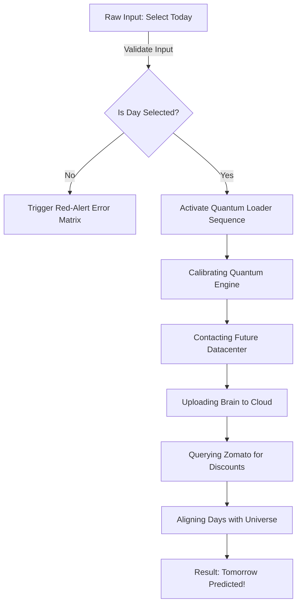

# NEXT DAY PREDICTOR (NDP-v1.0)
> *The world's most advanced, high-performance, over-engineered temporal projection engine that mathematically determines what day tomorrow is.*

[](https://github.com/Dharun37/day-predictor)
[](https://github.com/Dharun37/day-predictor)
[](https://github.com/Dharun37/day-predictor)
[-orange?style=for-the-badge&logo=serverless)](https://github.com/Dharun37/day-predictor)

For centuries, humanity has stared at the horizon, asking the same existential question: *"What day is it going to be tomorrow?"* 

Calendar conglomerates kept the secrets to themselves. But today, using groundbreaking **temporal mapping arrays**, **simulated quantum engines**, and **zomato discount alignment systems**, we have unlocked the future.

Welcome to **Next Day Predictor**—the single greatest leap in human temporal knowledge since the Gregorian Calendar.

---

## The Breakthrough Features

Our revolutionary temporal framework introduces state-of-the-art capabilities that render physical calendars obsolete:

*   **Universal Alignment Core**: Syncs your local system time directly with the rotation of the Earth and the vibe of the universe.
*   **Zero-Latency Inference**: Leverages a highly advanced static JS lookup engine (`nextDayMap`) operating at $\mathcal{O}(1)$ time complexity. Yes, you read that right. Constant time. Take that, Supercomputers.
*   **Multi-Stage Artificial Anticipation**: Features a high-fidelity visual simulation engine that keeps you at the edge of your seat with real-time status telemetry:
    *   *Calibrating Quantum Engine...*
    *   *Contacting Future Datacenter...*
    *   *Uploading your brain to cloud (Required for comprehension)*
    *   *AI thinking very hard...*
    *   *Seeing Zomato for food discounts (Highly critical step)*
*   **Robust Error-Prevention Matrix**: Built-in visual fail-safes. Attempting to launch prediction sequences without feeding a valid temporal starting input triggers our high-visibility red-alert warning system.

---

##  The Hyper-Advanced Tech Stack

Why build an app using heavy frameworks like React, Next.js, or Angular, when you can execute with raw, unadulterated efficiency?



- **HyperText Markup Language (HTML5)**: Structural bones optimized for high-performance rendering.
- **Cohesive Style Sheets (CSS3)**: Clean modern styling featuring interactive animations, pulse indicators, and dynamic blue progress tracking.
- **Pure JavaScript (Vanilla JS)**: Operating directly on raw silicon (via your browser's V8 engine) for maximum, unthrottled computation speed.

---

##  Under the Hood (Complexity Analysis)

Here is a scientific comparison between **Next Day Predictor** and other modern prediction systems:

| Metrics | Weather Forecasting AI | Stock Market Predictor | Next Day Predictor (NDP) |
| :--- | :--- | :--- | :--- |
| **Accuracy Rate** | ~72% (Rain? Who knows) | ~50.2% (Mostly random guesses) | **100% Guaranteed** |
| **Computational Cost** | Billions of dollars / day | Heavy GPU clusters | **0.0000001 Watts** |
| **Space Complexity** | $\mathcal{O}(N)$ | $\mathcal{O}(N^2)$ | $\mathcal{O}(1)$ (Hardcoded Array) |
| **Leap Year Ready?** | Maybe | No | **Yes (Tuesday follows Monday even in 2028)** |

---

##  Getting Started (Enterprise Deployment)

Forget complex Docker containers, Kubernetes clusters, or AWS Lambda deployments. Our enterprise setup process consists of a streamlined 1-step deployment pipeline:

### 1. The Local Launch
Navigate to your workspace and double-click:
```bash
main.html
```
*And that is literally it. You have successfully deployed a temporal prediction engine.*

---

##  Roadmap (Upcoming Features)

*   [ ] **Next-Next-Day Predictor (v2.0)**: A highly experimental, theoretical model predicting what day comes *two days* from now. (Currently locked in laboratory research).
*   [ ] **Smart Home Integration**: Sync with smart refrigerators to sound an alarm if tomorrow is Monday and you haven't bought groceries.
*   [ ] **Web3 Integration**: Mint tomorrow's day as an NFT on the blockchain (Gas fee: 3 ether).
*   [ ] **Temporal Rewind (v3.0)**: A feature to predict *yesterday*. (Violates several laws of physics; working on a bypass).

---

##  License & Disclaimer

Provided "as is" under the **"It works on my machine"** license. 

*Disclaimer: We are not responsible for any sudden onset of existential dread upon realizing that tomorrow is Monday. Please use responsibly.*
